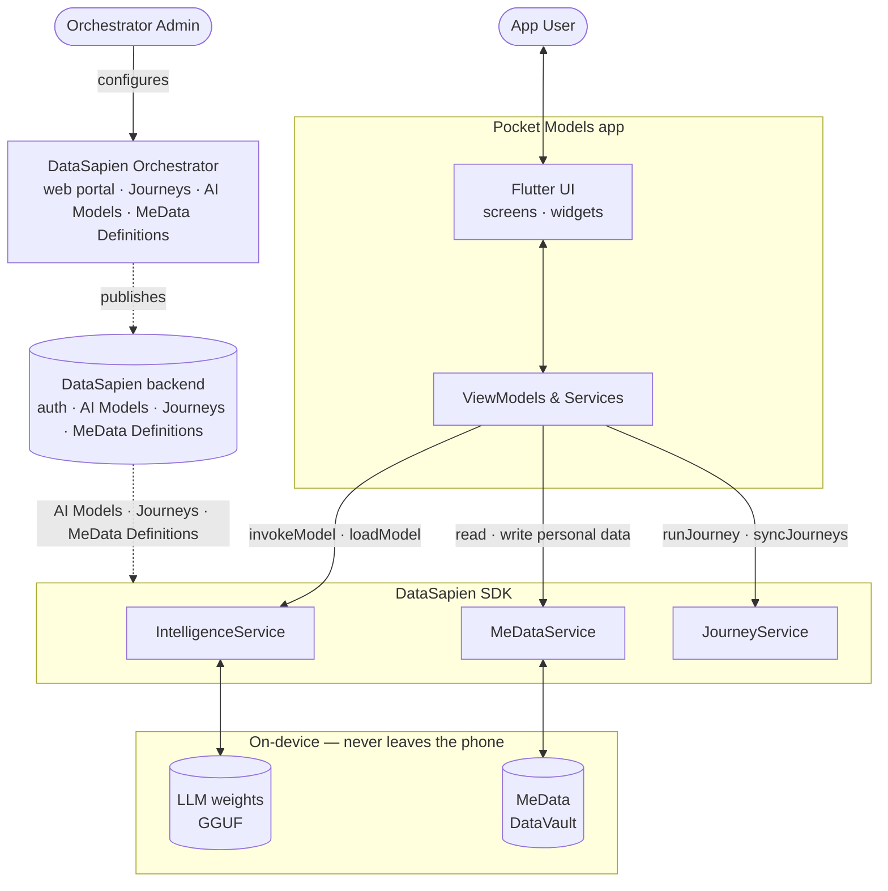

# Pocket Models

Flutter source code for **Pocket Models** — a privacy-first, on-device AI assistant
built on the [DataSapien](https://datasapien.com/) SDK. Run local LLMs against
your own personal data ("MeData") on your phone, without sending anything to
the cloud.

This repository contains the host-app source code. The DataSapien SDK itself
is a commercial product and requires a subscription —
see **<https://datasapien.com/pricing/>**.

## How it works



The diagram has two halves. **Config-time** (dashed): an Orchestrator Admin
uses the **DataSapien Orchestrator** (web portal) to publish Journeys,
register AI Models, and define MeData schemas — those flow into the
DataSapien backend, which the SDK pulls from at runtime. **Runtime**
(solid): the app's UI talks to ViewModels, which call into the three
DataSapien SDK services. Inference and personal data stay on the device.

---

## Table of contents

1. [Integrate with DataSapien](#integrate-with-datasapien)
2. [DataSapien API surface used in this app](#datasapien-api-surface-used-in-this-app)
   - [IntelligenceService](#intelligenceservice--datasapiengetintelligenceservice)
   - [MeDataService](#medataservice--datasapiengetmedataservice)
   - [JourneyService](#journeyservice--datasapiengetjourneyservice)
   - [Diagnostics](#diagnostics)
3. [Running the app](#running-the-app)
4. [Documentation links](#documentation-links)
5. [License](#license)

---

## Integrate with DataSapien

### 1. Add the SDK dependency

In `pubspec.yaml`:

```yaml
dependencies:
  datasapien_sdk: ^0.42.0
  datasapien_sdk_health: ^0.42.0   # optional — only if you use HealthKit / Health Connect
```

Then:

```bash
flutter pub get
```

### 2. Initialize and set up the SDK

The integration lives entirely in [`lib/main.dart`](lib/main.dart). You build a
`DataSapienConfig`, hand it to `DataSapien.initialize(...)`, then call
`DataSapien.setup()` once at startup.

```dart
import 'package:datasapien_sdk/datasapien_sdk.dart';

DataSapienConfig _buildDataSapienConfig() {
  return DataSapienConfig.builder()
      .setAuth(
        authUrl: 'YOUR_AUTH_URL',
        authClientId: 'YOUR_CLIENT_ID',
        authClientSecret: 'YOUR_CLIENT_SECRET',
        authScope: 'YOUR_AUTH_SCOPE',
      )
      .setHostUrl('YOUR_HOST_URL')
      .setMediaUrl('YOUR_MEDIA_URL')
      .setMainColor('#1464FA')
      .setDebug(true)
      .build();
}

void main() async {
  WidgetsFlutterBinding.ensureInitialized();

  final config = _buildDataSapienConfig();
  await DataSapien.initialize(config);

  // setup() validates credentials, hydrates managed-model metadata, etc.
  await DataSapien.setup();

  runApp(const MyApp());
}
```

#### Where do `YOUR_*` values come from?

You receive them when you subscribe to DataSapien
(<https://datasapien.com/pricing/>). The placeholders map to:

| Placeholder            | What it is                                                       |
|------------------------|------------------------------------------------------------------|
| `YOUR_AUTH_URL`        | OAuth2 token endpoint for your DataSapien tenant                 |
| `YOUR_CLIENT_ID`       | OAuth2 client ID                                                 |
| `YOUR_CLIENT_SECRET`   | OAuth2 client secret (**never commit to a public repo**)        |
| `YOUR_AUTH_SCOPE`      | OAuth2 scope for the DataSapien API                              |
| `YOUR_HOST_URL`        | Backend host URL (e.g. your tenant's MBE endpoint)               |
| `YOUR_MEDIA_URL`       | Media/CDN host used for managed-model artwork (also set in [`lib/utils/app_constants.dart`](lib/utils/app_constants.dart)) |

For production you should keep these out of source — load them from
environment variables, `--dart-define` flags, or a secure config file.

---

## DataSapien API surface used in this app

All SDK access goes through `DataSapien.getXxxService()` accessors. The three
services this app touches are listed below, grouped by purpose, with a short
description and a pointer to where each call is used in this codebase.

### IntelligenceService — `DataSapien.getIntelligenceService()`

On-device model management and inference.

| Method | What it does | Used in |
|---|---|---|
| `getManagedAIModels()` | Returns the full list of models registered for the tenant (downloadable catalog). Each entry has `name`, `multimodal`, `imageUrl`, etc. | [lib/services/model_selector_source.dart](lib/services/model_selector_source.dart), [lib/services/model_download_manager.dart](lib/services/model_download_manager.dart) |
| `getDownloadedModelsList()` | Lists names of models whose weights are already on disk. | [lib/services/model_download_manager.dart](lib/services/model_download_manager.dart) |
| `isModelFilesDownloaded(modelName)` | `true` if every weight file for the given model is present locally. | [lib/services/model_download_manager.dart](lib/services/model_download_manager.dart) |
| `downloadModelFiles(modelName, {onProgress})` | Downloads the model weights. `onProgress: (double p)` is called repeatedly with `0.0`–`1.0`. | [lib/services/model_download_manager.dart](lib/services/model_download_manager.dart) |
| `deleteModelFiles(modelName)` | Removes the model's weight files from disk. | [lib/services/model_download_manager.dart](lib/services/model_download_manager.dart) |
| `loadModel(modelName, modelKey, {modelParams})` | Loads the model into memory under an arbitrary `modelKey` you choose. `modelParams` carries context size / GPU layers / etc. | [lib/viewmodels/main_chat_view_model.dart](lib/viewmodels/main_chat_view_model.dart) |
| `unloadModel({key})` | Frees model memory for a previously loaded `modelKey`. | [lib/viewmodels/main_chat_view_model.dart](lib/viewmodels/main_chat_view_model.dart) |
| `invokeModel(modelKey, prompts, {inferenceParams, onStream})` | Runs an inference against a loaded model. Returns the full generated string. If `onStream: (String chunk) { ... }` is supplied, it fires per-token while generating. | [lib/viewmodels/main_chat_view_model.dart](lib/viewmodels/main_chat_view_model.dart) |
| `stopModelInference(modelKey)` | Cancels an in-flight `invokeModel` call for the given `modelKey`. | [lib/viewmodels/main_chat_view_model.dart](lib/viewmodels/main_chat_view_model.dart) |

### MeDataService — `DataSapien.getMeDataService()`

The user's local "MeData" store — categorized personal data the on-device
model can read at inference time. Everything stays on the device.

| Method | What it does | Used in |
|---|---|---|
| `getMeDataCategories()` | Returns top-level categories (e.g. Health, Personalization, Identity). | [lib/services/me_data_category_loader.dart](lib/services/me_data_category_loader.dart) |
| `getMeDataDefinitions()` | Returns every defined MeData key and its schema. | [lib/screens/settings/data_privacy_screen.dart](lib/screens/settings/data_privacy_screen.dart) |
| `getMeDataDefinitionsByCategory(categoryName)` | Definitions filtered to one category. | [lib/services/me_data_category_loader.dart](lib/services/me_data_category_loader.dart) |
| `getMeDataDefinition(definitionName)` | Single-definition lookup. Returns `null` if the definition isn't known. | [lib/viewmodels/main_chat_view_model.dart](lib/viewmodels/main_chat_view_model.dart) |
| `getMeDataRecords(definitionName)` | All stored values for a given MeData definition (history, newest-last). | [lib/services/me_data_category_loader.dart](lib/services/me_data_category_loader.dart) |
| `getLastMeDataRecord(definitionName)` | The most recently stored value for a definition. | [lib/viewmodels/main_chat_view_model.dart](lib/viewmodels/main_chat_view_model.dart) |
| `saveMeDataRecord(definitionName, value)` | Persists a new value (appends a new history entry). | [lib/theme/theme_manager.dart](lib/theme/theme_manager.dart), [lib/screens/settings/memory_settings_screen.dart](lib/screens/settings/memory_settings_screen.dart) |
| `deleteMeData(definitionName)` | Deletes **every** record for a definition. | [lib/screens/profile/my_data_tab.dart](lib/screens/profile/my_data_tab.dart) |
| `deleteMeDataRecord(definitionName, recordId)` | Deletes one specific history entry by its record ID. | [lib/screens/profile/my_data_history_screen.dart](lib/screens/profile/my_data_history_screen.dart) |

### JourneyService — `DataSapien.getJourneyService()`

Journeys are server-defined JS workflows that run on-device and produce
MeData outputs (e.g. an onboarding sequence that fills in baseline data).

| Method | What it does | Used in |
|---|---|---|
| `getJourneys({tags, statuses, onlyInAudience})` | Lists journeys available to the user, filterable by `tags` (e.g. `['ai']`), `statuses` (`JourneyStatus.notStarted`, `.completed`, …), and `onlyInAudience: true` to hide journeys the user doesn't qualify for. | [lib/screens/profile/journeys_tab.dart](lib/screens/profile/journeys_tab.dart), [lib/screens/chat/main_chat_screen.dart](lib/screens/chat/main_chat_screen.dart) |
| `runJourney(journeyName, {data})` | Executes a journey by name. `data` is a `Map<String, dynamic>` of inputs the journey script may consume. | [lib/screens/profile/journeys_tab.dart](lib/screens/profile/journeys_tab.dart) |
| `syncJourneys()` | Re-pulls the latest journey definitions from the backend and re-evaluates derived MeData. Call after any MeData mutation that may unlock new journeys. | [lib/viewmodels/main_chat_view_model.dart](lib/viewmodels/main_chat_view_model.dart) |

### Diagnostics

`DataSapienDiagnostics` records SDK + UI events for support escalation. Setup
example from [`lib/main.dart`](lib/main.dart):

```dart
DataSapienDiagnostics.instance
  ..configure(
    const DataSapienDiagnosticsConfig(
      mode: DataSapienDiagnosticsMode.verboseSupport,
    ),
  )
  ..setEnabled(true)
  ..logUiEvent('Pocket Models diagnostics recording started');
```

---

## Running the app

```bash
flutter pub get
flutter run
```

The app will start, but **inference and MeData calls will fail until you
replace the `YOUR_*` placeholders** in [`lib/main.dart`](lib/main.dart) and
[`lib/utils/app_constants.dart`](lib/utils/app_constants.dart) with real
DataSapien credentials.

Pocket Models also uses Firebase Crashlytics. You'll need to run
[`flutterfire configure`](https://firebase.flutter.dev/docs/cli/) once to
generate `lib/firebase_options.dart` and the platform config files before
the app will build for Android/iOS. Both are gitignored.

---

## Documentation links

- **DataSapien developer portal:** <https://dev.datasapien.com/>
- **DataSapien marketing site:** <https://datasapien.com/>
- **Pricing & SDK subscription:** <https://datasapien.com/pricing/>
- **Flutter SDK on pub.dev:** [`datasapien_sdk`](https://pub.dev/packages/datasapien_sdk) · [`datasapien_sdk_health`](https://pub.dev/packages/datasapien_sdk_health)

---

## License

MIT. See [`LICENSE`](LICENSE).

**Note:** the MIT license covers only the host-app source code in this
repository. The DataSapien SDK is a separate commercial product behind
<https://datasapien.com/pricing/>.
